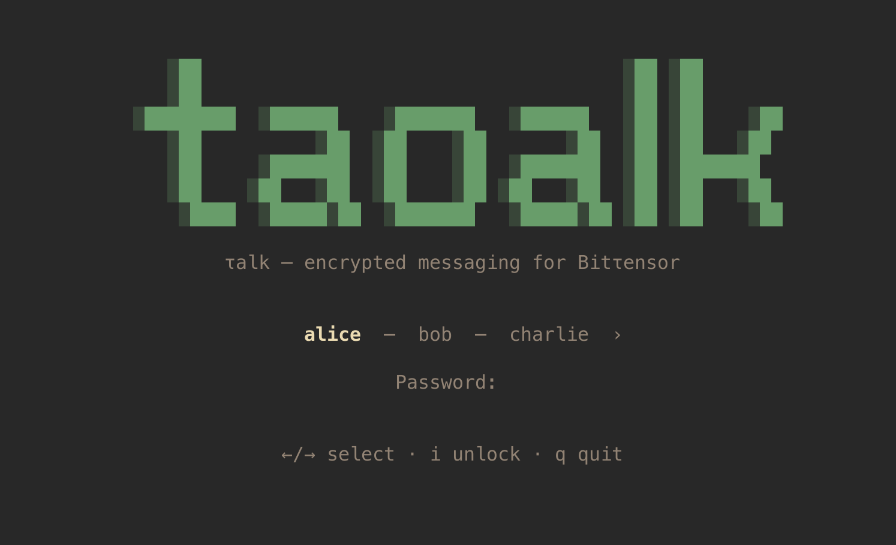

# τalk — End-to-end encrypted messaging for Bittensor

Built on [SAMP](https://github.com/samp-org/samp) (Substrate Account Messaging Protocol). Runs as a terminal UI for humans, a CLI for setup, and an embeddable Rust SDK for agents and scripts.


## Install

```
cargo install --path .
```

Requires Rust 1.85+. The release build uses LTO and strips debug symbols.

## Quick start

Create a wallet:

```
taolk wallet create --name alice --password secret
```

Launch the TUI:

```
taolk
```

If you have one wallet, it opens directly. Multiple wallets show a selector on the lock screen.



## TUI

Vim-style modal interface.

| Mode | Keys |
|------|------|
| Normal | `j`/`k` navigate sidebar, `i` compose, `q` quit |
| Insert | Type message, `Enter` send, `Esc` cancel |
| Confirm | `Enter` confirm send, `Esc` back to edit |

`Ctrl+L` locks the session. Auto-lock after 5 minutes (configurable).

### Messaging

- **Threads** — encrypted 1:1 conversations (sr25519 ECDH + ChaCha20-Poly1305)
- **Channels** — public, named, discoverable
- **Groups** — encrypted multi-party conversations, fixed membership

All messages are signed remarks on-chain. Every message has a verifiable sender.

## CLI

```
taolk wallet create --name <name> [--password <pw>]
taolk wallet import --name <name> --mnemonic "word1 word2 ..." [--password <pw>]
taolk wallet import --name <name> --seed <64-hex-chars> [--password <pw>]
taolk wallet list
taolk config list
taolk config get [<key>]
taolk config set <key> <value>
taolk config unset <key>
taolk config edit
taolk config path
```

Without `--password`, wallet commands prompt interactively.

## SDK

Use taolk as a library for bots, agents, or scripts. No terminal dependencies.

```toml
[dependencies]
taolk = { path = ".", default-features = false }
```

```rust
use taolk::{session::Session, event::Event, wallet, types::Pubkey};

#[tokio::main]
async fn main() -> taolk::error::Result<()> {
    let seed = wallet::open("agent", "password")?;
    let (session, mut events) = Session::start(&seed, "wss://entrypoint-finney.opentensor.ai:443", "agent").await?;

    // Send an encrypted message
    let recipient = Pubkey([/* 32 bytes */]);
    session.send_encrypted(&recipient, "hello").await?;

    // Listen for incoming messages
    while let Some(event) = events.recv().await {
        match event {
            Event::NewMessage { decrypted_body: Some(body), sender, .. } => {
                println!("{}: {body}", taolk::util::ss58_short(&sender));
            }
            _ => {}
        }
    }

    Ok(())
}
```

The SDK exposes the same operations as the TUI: threads, channels, groups, balance queries, fee estimation.

## Configuration

`~/.config/taolk/config.toml` (XDG on Linux, `~/Library/Application Support/` on macOS).

| Key | Default | Description |
|-----|---------|-------------|
| `wallet.default` | — | Wallet to open on launch |
| `network.node` | `wss://entrypoint-finney.opentensor.ai:443` | Subtensor node WebSocket URL |
| `network.mirrors` | — | SAMP mirror URLs for channel sync |
| `security.lock_timeout` | `300` | Auto-lock seconds (0 = disabled) |
| `ui.sidebar_width` | `28` | Sidebar width in columns |
| `ui.mouse` | `true` | Mouse support |
| `ui.timestamp_format` | `%H:%M` | Message time format |
| `ui.date_format` | `%Y-%m-%d %H:%M` | Full date format |

## Security

Wallet files are encrypted with Argon2id (64 MB, 3 iterations) and ChaCha20-Poly1305. Stored at `~/.samp/wallets/` with 0600 permissions.

In memory, the seed is held in a `Zeroizing<[u8; 32]>` wrapper — not copyable, automatically zeroed on drop. Passwords use `Zeroizing<String>`. All cryptographic intermediates (shared secrets, symmetric keys, ephemeral scalars) are explicitly zeroized before function return.

On the wire, 1:1 and group messages use ECDH on Ristretto255 with ChaCha20-Poly1305 AEAD. Each group message is independently encrypted for every member. Channels are plaintext (public by design).

The private key never leaves the client. No key material is sent over the network.

## Dependencies

Pure Rust. TLS via rustls (no OpenSSL). SQLite bundled via rusqlite. The SDK (without TUI features) pulls no terminal dependencies.

## Building

```
cargo build --release          # TUI + CLI binary
cargo check --no-default-features --lib   # SDK only (no TUI deps)
cargo test                     # Run protocol tests
```

## License

```
MIT License

Copyright (c) 2025 Maciej Kula

Permission is hereby granted, free of charge, to any person obtaining a copy
of this software and associated documentation files (the "Software"), to deal
in the Software without restriction, including without limitation the rights
to use, copy, modify, merge, publish, distribute, sublicense, and/or sell
copies of the Software, and to permit persons to whom the Software is
furnished to do so, subject to the following conditions:

The above copyright notice and this permission notice shall be included in all
copies or substantial portions of the Software.

THE SOFTWARE IS PROVIDED "AS IS", WITHOUT WARRANTY OF ANY KIND, EXPRESS OR
IMPLIED, INCLUDING BUT NOT LIMITED TO THE WARRANTIES OF MERCHANTABILITY,
FITNESS FOR A PARTICULAR PURPOSE AND NONINFRINGEMENT. IN NO EVENT SHALL THE
AUTHORS OR COPYRIGHT HOLDERS BE LIABLE FOR ANY CLAIM, DAMAGES OR OTHER
LIABILITY, WHETHER IN AN ACTION OF CONTRACT, TORT OR OTHERWISE, ARISING FROM,
OUT OF OR IN CONNECTION WITH THE SOFTWARE OR THE USE OR OTHER DEALINGS IN THE
SOFTWARE.
```
