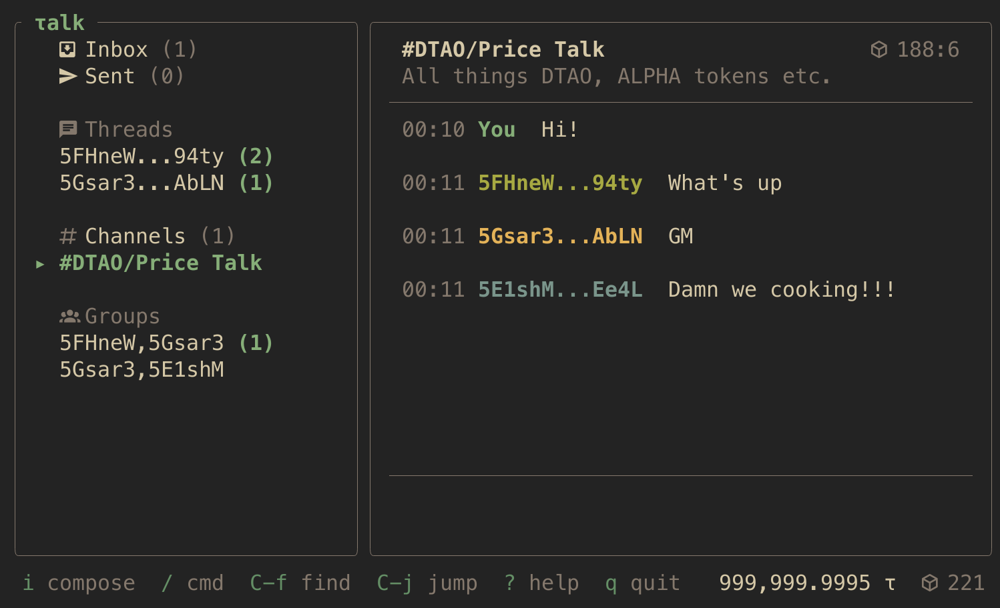

<p align="center">
  
</p>

<h1 align="center">τalk</h1>

<p align="center">
  <strong>End-to-end encrypted messaging for Bittensor.</strong>
</p>

<p align="center">
  <a href="https://codecov.io/gh/mcjkula/taolk"></a>
</p>

<p align="center">
  <a href="#install">Install</a> •
  <a href="#getting-started">Getting started</a> •
  <a href="#tui">TUI</a> •
  <a href="#cli">CLI</a> •
  <a href="#sdk">SDK</a> •
  <a href="#security">Security</a>
</p>

---

Built on [SAMP](https://github.com/samp-org/samp) (Substrate Account Messaging Protocol). Runs as a terminal UI for humans, a CLI for setup, and an embeddable Rust SDK for agents and scripts.

## Install

```
cargo install --path .
```

Requires Rust 1.85+. On **Linux**, install ALSA headers for notification sounds:

```
sudo apt install libasound2-dev      # Debian / Ubuntu
sudo pacman -S alsa-lib              # Arch
sudo dnf install alsa-lib-devel      # Fedora
```

macOS and Linux supported. Windows is not currently built or tested.

## Getting started

1. **Create a wallet.** Write down the 12-word recovery phrase — it's the only way to recover funds and message history.
   ```
   taolk wallet create --name alice
   ```
2. **Fund it.** Your SS58 address is shown on the lock screen. Transfer τ from an exchange or testnet faucet.
3. **Launch.**
   ```
   taolk
   ```
4. **Send a self-DM.** Your own SS58 is always a valid recipient. If it round-trips, the setup works end-to-end.
5. **Message a friend.** Share SS58 addresses out of band, press `n` to start a thread.
6. **Browse channels.** Press `c` to open the channel directory.

## TUI

Press `?` for the in-app keybind reference. Press `/` to open the command palette.

| Context | Keys |
|---------|------|
| Timeline | `i` compose, `n` thread, `m` message, `c` channels, `g` group, `/` commands, `?` help, `q` quit |
| Composer | `Enter` send, `Shift+Enter` newline, `Esc` save draft and leave |
| Confirm | `Enter` submit transaction, `Esc` back to edit |
| Global | `Ctrl+L` lock, `Ctrl+W` switch wallet, `Ctrl+C` quit |

### Messaging

- **Threads** — encrypted 1:1 conversations (Ristretto255 ECDH + ChaCha20-Poly1305)
- **Channels** — public, named, discoverable
- **Groups** — encrypted multi-party, fixed membership
- **One-off messages** — public or encrypted, standalone

All messages are signed remarks on-chain. Every message has a verifiable sender.

### Commands

15 commands available via `/` in the TUI:

| Command | What it does |
|---------|-------------|
| `thread` | Start a new 1:1 thread |
| `message` | Send a standalone one-off message |
| `group` | Create a group conversation |
| `search` | Search messages in current view |
| `channels` | Browse the channel directory |
| `inbox` | Jump to inbox |
| `outbox` | Jump to sent |
| `sidebar` | Toggle sidebar |
| `help` | Show help overlay |
| `get` | Fetch remark(s) at block:index positions |
| `refresh` | Reload and fill message gaps |
| `copy` | Copy a sender's SS58 address |
| `unlock` | Unlock locked outbound messages |
| `lock` | Lock the session |
| `wallet` | Switch wallet |
| `quit` | Exit |

## CLI

```
taolk wallet create --name <name> [--password <pw>]
taolk wallet import --name <name> --mnemonic "word1 word2 ..."
taolk wallet import --name <name> --seed <64-hex-chars>
taolk wallet list
taolk db clear [--wallet <name>]
taolk config get [<key>]
taolk config set <key> <value>
taolk config unset <key>
```

## SDK

Use taolk as a library. No terminal dependencies.

```toml
[dependencies]
taolk = { path = ".", default-features = false }
```

```rust
use taolk::{session::Session, event::Event, wallet};

#[tokio::main]
async fn main() -> taolk::error::Result<()> {
    let seed = wallet::open("agent", "password")?;
    let (session, mut events) = Session::start(
        seed.as_bytes(), "wss://entrypoint-finney.opentensor.ai:443", "agent", true,
    ).await?;

    while let Some(event) = events.recv().await {
        match event {
            Event::NewMessage { decrypted_body: Some(body), sender, .. } => {
                println!("{}: {body}", taolk::util::ss58_short(&sender));
            }
            _ => {}
        }
    }
    Ok(())
}
```

## Configuration

`~/.config/taolk/config.toml` (XDG on Linux, `~/Library/Application Support/` on macOS).

| Key | Default | Description |
|-----|---------|-------------|
| `wallet.default` | — | Wallet to open on launch |
| `network.node` | `wss://entrypoint-finney.opentensor.ai:443` | Subtensor node URL |
| `network.mirrors` | — | SAMP mirror URLs |
| `security.lock_timeout` | `300` | Auto-lock seconds (0 = disabled) |
| `security.require_password_per_send` | `false` | Prompt password for every transaction |
| `ui.sidebar_width` | `28` | Sidebar width |
| `ui.mouse` | `true` | Mouse support |
| `ui.timestamp_format` | `%H:%M` | Message time format |
| `ui.date_format` | `%Y-%m-%d %H:%M` | Full date format |

## Mirrors

Mirrors index SAMP remarks and serve them via HTTP. Configure:

```
taolk config set network.mirrors https://bittensor-finney.samp.ink
```

Run your own with [mirror-template](https://github.com/samp-org/mirror-template).

## Security

Wallet files: Argon2id (64 MB, 3 iterations) + ChaCha20-Poly1305. Stored with `0600` permissions.

Secret types (`Seed`, `Password`, `Phrase`, `SigningKey`): no `Clone`, no `Debug`, no `Display`. All wrap `Zeroizing` and are zeroed on drop. When `require_password_per_send` is enabled, the signing key is never stored — it exists only between password entry and transaction submission, then is dropped.

On the wire: 1:1 and group messages use ECDH on Ristretto255 with ChaCha20-Poly1305 AEAD. Channels are plaintext by design. The private key never leaves the client.

### Trade-offs

- **No forward secrecy.** Seed compromise decrypts all past 1:1/thread messages.
- **Key reuse.** sr25519 signing and Ristretto255 ECDH share the same scalar. No known attack.
- **On-chain metadata is public.** Sender, recipient, block height, timestamp are visible.
- **No post-quantum resistance.** Ristretto255 is broken by Shor.

## Building

```
cargo build --release                        # TUI + CLI
cargo check --no-default-features --lib      # SDK only
cargo test                                   # 355 tests
```

## License

MIT — see [LICENSE](LICENSE).
