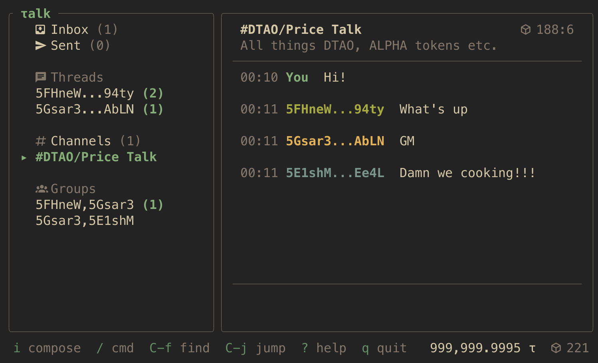

<p align="center">
  
</p>

<h1 align="center">τalk</h1>

<p align="center">
  <strong>End-to-end encrypted messaging for Bittensor.</strong>
</p>

<p align="center">
  <a href="https://codecov.io/gh/mcjkula/taolk"></a>
</p>

<p align="center">
  <a href="#install">Install</a> •
  <a href="#getting-started">Getting started</a> •
  <a href="#tui">TUI</a> •
  <a href="#cli">CLI</a> •
  <a href="#sdk">SDK</a> •
  <a href="#security">Security</a>
</p>

---

Built on [SAMP](https://github.com/samp-org/samp) (Substrate Account Messaging Protocol). Terminal UI, CLI, and embeddable Rust SDK.

## Install

```
brew install mcjkula/tap/taolk
```

Or with Cargo: `cargo install taolk`

Or from source: `git clone https://github.com/mcjkula/taolk.git && cd taolk && cargo install --path .`

> Linux requires `libasound2-dev` (Debian/Ubuntu), `alsa-lib` (Arch), or `alsa-lib-devel` (Fedora).

### A Nerd Font is required

taolk's interface uses [Nerd Font](https://www.nerdfonts.com/) icon glyphs — specifically
Material Design Icons in the Unicode Private Use Area (`U+F0000`–`U+F1AF0`). Without a Nerd
Font, these render as blank boxes ("tofu") or the wrong characters. This is not a terminal
bug: your terminal simply has no font containing the glyphs.

**Recommended: install a full patched Nerd Font and set it as your terminal's font** (e.g.
`JetBrainsMono Nerd Font`). A full patched font sizes every icon to exactly one cell, so the
icons *and* taolk's box-drawing borders stay aligned.

| Platform | Install a full Nerd Font |
|----------|--------------------------|
| Arch | `sudo pacman -S ttf-jetbrains-mono-nerd` |
| macOS (Homebrew) | `brew install --cask font-jetbrains-mono-nerd-font` |
| Debian / Ubuntu / Fedora / other | Download from [nerdfonts.com](https://www.nerdfonts.com/font-downloads), unzip into `~/.local/share/fonts/`, then `fc-cache -f` |

After installing, run `fc-cache -f` and **fully restart your terminal**, then set the terminal's
font to the Nerd Font.

#### Why not the symbols-only font?

The symbols-only *Symbols Nerd Font* works as an automatic fontconfig fallback and makes the
icons *visible* — but in VTE-based terminals (GNOME Terminal) its glyphs render ~1.6 cells
wide. taolk lays each icon out as one cell, so the overflow shifts everything after it and
**breaks the panel borders and column alignment**. Prefer a full patched font as the primary
font; it renders icons at exactly one cell.

#### GNOME Terminal

1. **Install a full Nerd Font** and run `fc-cache -f` (above).
2. **Restart the terminal _server_, not just the window.** GNOME Terminal runs a single
   long-lived `gnome-terminal-server` that loads fonts once at startup; opening a new window
   reuses it and won't see a newly installed font. **Log out and back in** so the server
   reloads fonts.
3. **Set the profile font:** Preferences → your profile → Text → Custom font →
   `JetBrainsMono Nerd Font`.
4. **Use a normal-contrast palette.** taolk draws borders and dim/secondary text with the
   terminal's ANSI "dark gray". Low-contrast schemes (e.g. Solarized) can make those nearly
   invisible. If borders or some text disappear, switch to a conventional palette (the default
   GNOME palette, Tango, or a Tokyo Night-style palette).

Tip: leave your everyday profile untouched and add a dedicated profile (e.g. `taolk`) with the
Nerd Font + a normal-contrast palette, then launch with `gnome-terminal --profile=taolk`.

#### Verify the setup (Linux)

```
# 1) fontconfig resolves the icon range to a Nerd Font (not Noto/DejaVu):
fc-match ':charset=f0423'

# 2) the Pango/VTE render path actually selects the Nerd Font for the glyph:
python3 - <<'PY'
import gi; gi.require_version('Pango','1.0'); gi.require_version('PangoCairo','1.0')
from gi.repository import Pango, PangoCairo
import cairo
cr = cairo.Context(cairo.ImageSurface(cairo.FORMAT_ARGB32, 8, 8))
l = PangoCairo.create_layout(cr)
l.set_font_description(Pango.FontDescription("monospace 16"))
l.set_text("\U000F0423", -1)  # CHANNELS icon
print(l.get_iter().get_run_readonly().item.analysis.font.describe().to_string())
PY
```

## Getting started

### 1. Create a wallet

```
taolk wallet create --name <name>
```

The name identifies this wallet on the lock screen. Write down the 12-word recovery phrase before confirming.

### 2. Fund your account

taolk prints your address after creation. Each message is an on-chain transaction, so you need a small balance for fees. Transfer τ from an exchange or testnet faucet.

### 3. Launch

```
taolk --wallet <name> --mirror https://bittensor-finney.samp.ink
```

`--wallet` selects which wallet to unlock. `--mirror` connects to a SAMP mirror for channel discovery and message history. Both are optional.

### 4. Verify your setup

Press `m`, paste your own address, pick public, type something. If it appears in your inbox, the full pipeline works.

### 5. Start messaging

Press `n` to start a thread with someone. Press `c` to browse public channels.

## TUI

Press `?` for the keybind reference. Press `/` to open the command palette.

| Context | Keys |
|---------|------|
| Timeline | `i` compose, `n` thread, `m` message, `c` channels, `g` group, `/` commands, `?` help, `q` quit |
| Composer | `Enter` send, `Shift+Enter` newline, `Esc` save draft and leave |
| Confirm | `Enter` submit transaction, `Esc` back to edit |
| Global | `Ctrl+L` lock, `Ctrl+W` switch wallet, `Ctrl+C` quit |

### Messaging

- **Threads**: encrypted 1:1 conversations (Ristretto255 ECDH + ChaCha20-Poly1305)
- **Channels**: public, named, discoverable
- **Groups**: encrypted multi-party, fixed membership
- **One-off messages**: public or encrypted, standalone

All messages are signed remarks on-chain with a verifiable sender.

### Commands

Commands available via `/`:

| Command | What it does |
|---------|-------------|
| `thread` | Start a new 1:1 thread |
| `message` | Send a standalone one-off message |
| `group` | Create a group conversation |
| `search` | Search messages in current view |
| `channels` | Browse the channel directory |
| `inbox` | Jump to inbox |
| `outbox` | Jump to sent |
| `sidebar` | Toggle sidebar |
| `help` | Show help overlay |
| `get` | Get remark(s) at block:index positions |
| `refresh` | Reload and fill message gaps |
| `copy` | Copy a sender's address |
| `unlock` | Unlock locked outbound messages |
| `lock` | Lock the session |
| `wallet` | Switch wallet |
| `quit` | Exit |

## CLI

```
taolk wallet create --name <name> [--password <pw>]
taolk wallet import --name <name> --mnemonic "word1 word2 ..."
taolk wallet import --name <name> --seed <64-hex-chars>
taolk wallet list
taolk db clear [--wallet <name>]
taolk config get [<key>]
taolk config set <key> <value>
taolk config unset <key>
```

## SDK

Use taolk as a library. No terminal dependencies.

```toml
[dependencies]
taolk = { path = ".", default-features = false }
```

```rust
use taolk::{session::Session, event::Event, wallet};

#[tokio::main]
async fn main() -> taolk::error::Result<()> {
    let seed = wallet::open("agent", "password")?;
    let (session, mut events) = Session::start(
        seed.as_bytes(), "wss://entrypoint-finney.opentensor.ai:443", "agent", true,
    ).await?;

    while let Some(event) = events.recv().await {
        match event {
            Event::NewMessage { decrypted_body: Some(body), sender, .. } => {
                println!("{}: {body}", taolk::util::ss58_short(&sender));
            }
            _ => {}
        }
    }
    Ok(())
}
```

## Configuration

`~/.config/taolk/config.toml` (XDG on Linux, `~/Library/Application Support/` on macOS).

| Key | Default | Description |
|-----|---------|-------------|
| `wallet.default` | | Wallet to open on launch |
| `network.node` | `wss://entrypoint-finney.opentensor.ai:443` | Subtensor node URL |
| `network.mirrors` | | SAMP mirror URLs |
| `security.lock_timeout` | `300` | Auto-lock seconds (0 = disabled) |
| `security.require_password_per_send` | `false` | Prompt password for every transaction |
| `ui.sidebar_width` | `28` | Sidebar width |
| `ui.mouse` | `true` | Mouse support |
| `ui.timestamp_format` | `%H:%M` | Message time format |
| `ui.date_format` | `%Y-%m-%d %H:%M` | Full date format |

## Mirrors

Mirrors index SAMP remarks and serve them over HTTP for channel discovery and message history. Mirrors never see decrypted content. taolk verifies all data against the chain.

```
taolk config set network.mirrors https://bittensor-finney.samp.ink
```

| Network | URL |
|---------|-----|
| Mainnet | `https://bittensor-finney.samp.ink` |
| Testnet | `https://bittensor-testnet.samp.ink` |

Run your own with [mirror-template](https://github.com/samp-org/mirror-template).

## Security

Wallet files: Argon2id (64 MB, 3 iterations) + ChaCha20-Poly1305. Stored with `0600` permissions.

Secret types (`Seed`, `Password`, `Phrase`, `SigningKey`): no `Clone`, no `Debug`, no `Display`. All wrap `Zeroizing` and are zeroed on drop. When `require_password_per_send` is enabled, the signing key is not stored in memory. It exists only between password entry and transaction submission.

On the wire: 1:1 and group messages use ECDH on Ristretto255 with ChaCha20-Poly1305 AEAD. Channels are plaintext by design. The private key never leaves the client.

### Trade-offs

- **Key reuse.** sr25519 signing and Ristretto255 ECDH share the same scalar.
- **No post-quantum resistance.** Ristretto255 is broken by Shor.
- **No forward secrecy.** Seed compromise decrypts all past 1:1/thread messages.

## Building

```
cargo build --release                        # TUI + CLI
cargo check --no-default-features --lib      # SDK only
cargo test                                   # 374 tests
```

## License

MIT. See [LICENSE](LICENSE).
